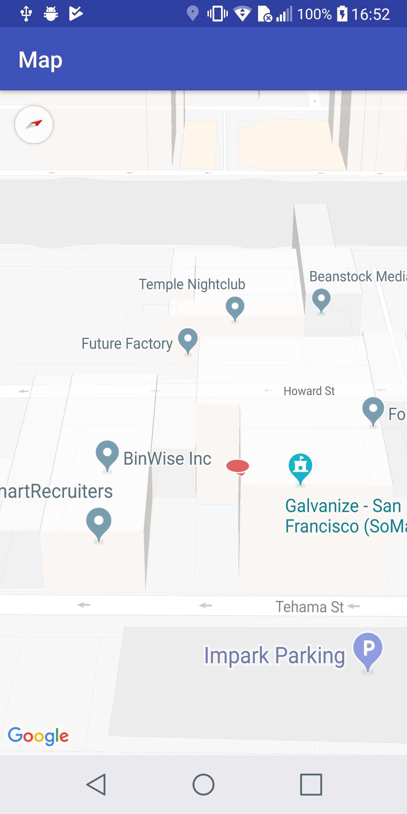

This is an example of Navisens' SDK integration with GoogleMaps' SDK.

Get a key for the Android Google Maps SDK [here](https://developers.google.com/maps/documentation/android-sdk/signup).  
And add it to `Debug/res/values/google_maps_api.xml` for debug or for release: `Release/res/values/google_maps_api.xml`

Then retrieve a Navisens SDK key [here](https://navisens.com/).  
And add it to the `runMotionDna` method in the `MapsActivity` file.

After completing these steps should be seeing the Navisens position on the MapBox canvas.

Have fun!

